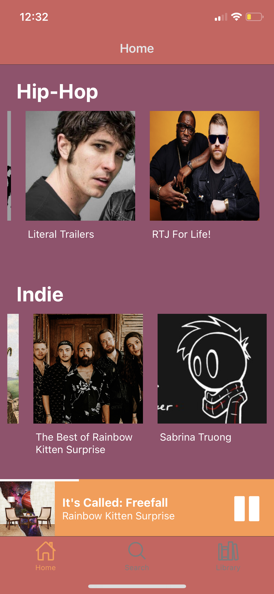

# "Mockify": A Spotify (Music Streaming App) Clone 
## Motivation for Project: 
To learn more about mobile app development using React Native and Expo, and to learn about setting up a backend using Amazon Web Services.
## Outcomes: 
This project was very fun and I was able to learn about things which I am unfamiliar with (TypeScript, GraphQL, etc) in a very practical and technical way. It also gave me a basic idea of how a full-stack developer thinks about things through the various stages of the devleopment process of an application.

## Functionality: 
The app is has a responsive "Home" and "Album" screen, with the exception of the album play button. The playing widget overlay is fully functional (plays song which is clicked on, changes song and song details when another song is clicked, plays/pauses song when button is clicked), but can be improved to support scrubbing.
#### Home Screen


#### Album Screen:


## Using Expo CLI:
```
npm install
expo start
```
