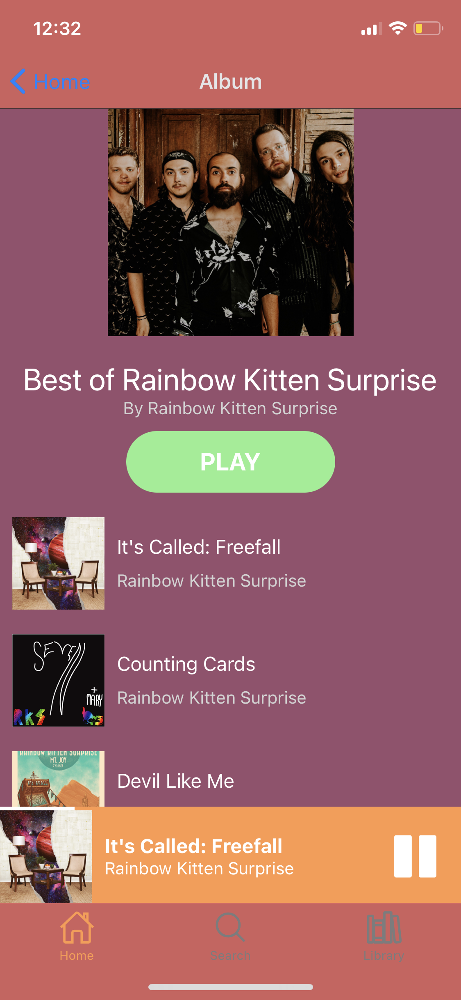

# "Mockify": A Spotify (Music Streaming App) Clone 
### Motivation for Project: Learn more about mobile app development using React Native and Expo, and to learn about setting up a backend using Amazon Web Services.

### Album Screen:

### Home Screen

## Using Expo CLI:
### `npm install`
### `expo start`

